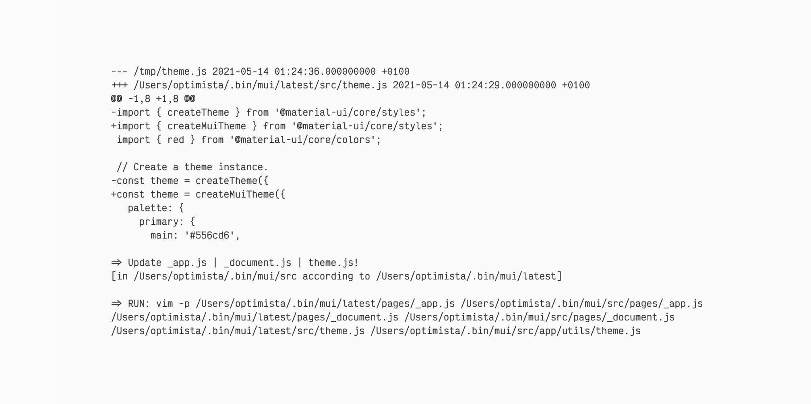
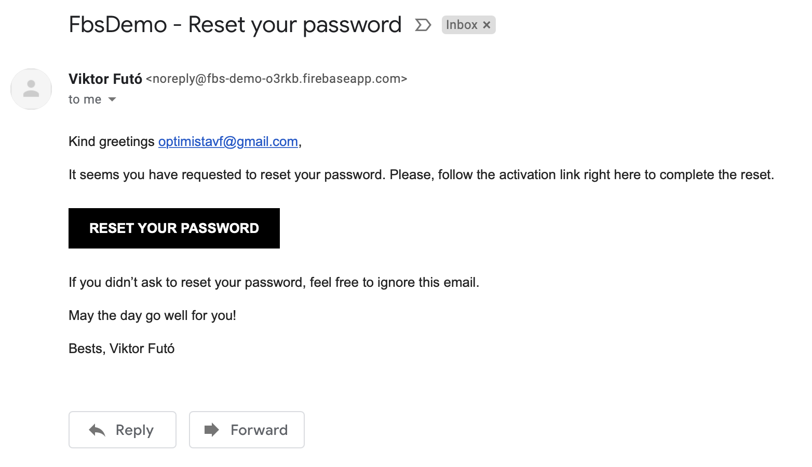

# Futo

Collection of boilerplate generator scripts (`vc`, `mui`, `fbc`, `fbs`) which generate a web application project with following integrations

## 1. `vc` = Vercel / Next.js (1/4)
Generates a new, minimal Vercel / Next.js project and 'cleans it up' - removes some stuff that we do not need.

### Screens


### Usage
```
vc demo # To generate a new project
vc rm demo # To remove existing project (must be run from parent directory)
```

These work according to expectations: `vc dev`, `vc ls`, `vc --prod` 

### Caveat
Yes, the script has the same abbreviation as `vc` shortcut for `vercel`, for that reason we suggest usign `vercel` to access original `vercel` functionality. `vc dev`, `vc ls` and `vc --prod` do work as in the standard script.

## 2. `mui` = `vc` + Material-UI (2/4)
Does everything above and integrates into the project Material-UI component library and copies into its own theme and preview page of a theme.

### Screens
[](https://mui-demo.vercel.app)
[](https://mui-demo.vercel.app/theme)

### Usage
```
mui myappname # To generate a new project
mui rm myappname # To remove existing project (must be run from parent directory)
```

### Caveat: Be aware of Vercel / Next.js + Material-UI integration latest version check
There is a mechanism within the script that checks the latest example of Material-UI and Next.js integration directly from https://github.com/mui-org/material-ui/tree/next/examples/nextjs repository. In case the integration template in official mui repository has been changed, the script does not generate a project and you are warned about the needed update that needs to be done manually. The latest official integration files are downloaded into `latest` folder, while those that needs to be updated manually are in `src`. Just run the recommended `vim` script and update the changes printed by `diff`.



## 3. `fbc` = `mui` + Firebase Client (3/4)
Does everything above and creates and sets up Google's Firebase project with a web application and integrates it into the project with working authentication, authorization through firestore rules, password reset, profiles with skeleton components, upload of profile pictures through Firebase Storage and realtime updated firestore posts feed with infinite scrolling.

### Screens
[](https://fbs-demo.vercel.app/)
[](https://fbs-demo.vercel.app/theme)
[](https://fbs-demo.vercel.app/)
[](https://fbs-demo.vercel.app/)
[](https://fbs-demo.vercel.app/login)
[](https://fbs-demo.vercel.app/join)
[](https://fbs-demo.vercel.app/optimista)
[](https://fbs-demo.vercel.app/optimista)
[](https://fbs-demo.vercel.app/optimista)
[](https://fbs-demo.vercel.app/optimista)
[](https://fbs-demo.vercel.app/)
[](https://fbs-demo.vercel.app/)
[](https://fbs-demo.vercel.app/account/reset)
[](https://fbs-demo.vercel.app/account/reset)
[](https://fbs-demo.vercel.app/account/confirm)

### Usage
```
fbc myappname # To generate a new project
fbc rm myappname # To remove existing project (must be run from parent directory)
```

## 4. `fbs` = `fbc` + Firebase Server (4/4)
Does everything above and creates keys and configures project for the use of firebase also on the server side. Demonstrates fetching on server side on profile page on pre-loading of the information for social media open graph tags.

### Screens
Same as in `fbc` above +  

[](https://developers.facebook.com/tools/debug/?q=https%3A%2F%2Ffbs-demo.vercel.app%2Foptimista)
[](https://fbs-demo.vercel.app/account/confirm)

### Usage
```
fbs myappname # To generate a new project
fbs rm myappname # To remove existing project (must be run from parent directory)
```

## Prerequisites

### `expect`
```
brew install expect
```

### `npm`

Follow official installation instructions [here](https://docs.npmjs.com/downloading-and-installing-node-js-and-npm#os-x-or-windows-node-installers).  
  
However, downloading and running one of the LTS pre-built installers from [here](https://nodejs.org/en/download/) should be enough.

### `vercel`

```
npm i -g vercel
```

### `firebase`

Follow official installation instructions [here](https://firebase.google.com/docs/cli#mac-linux-npm)  
  
However, this should be enough to install it and login:

```
npm install -g firebase-tools && firebase login
```

### `gcloud`

Follow official installation instructions [here](https://cloud.google.com/sdk/docs/install#mac)  
  
However, this should be enough to intall it:

1. [Download your preferred archive from here](https://cloud.google.com/sdk/docs/install#mac) and extract it into your preferred location of `gcloud` script (e.g. `/opt/`)
2. From extracted directory, run `./install.sh`
3. Log in using `gcloud init`

## Installation

Be sure that you have `~/.bin` folder from which you load your scripts:

```
mkdir ~/.bin
echo 'for d in ~/.bin/*/bin; do export PATH="$d:$PATH"; done' >> ~/.zshrc
echo 'export PATH=~/.bin:$PATH' >> ~/.zshrc
```

If you do, then just run this and you are fine.

```
git clone git@github.com:optimista/futo.git
mv futo/vc futo/mui futo/fbc futo/fbs ~/.bin
rm -rf futo
```

### Explanation

I have all my scripts in `~/.bin` folder.  
Simple ones are in one file (`~/.bin/simplescript`).  
Complex ones are within a folder (`~/.bin/complexscript/bin/complexscript`).  
I load them in my `~/.zshrc` (if you use bash `~/.bashrc`).  

### Caveat: Change `open` to your browser 
The scripts have been made in OSX environment. They utilize `open` command to open URL links during the process of generation. If you use Linux distribution or different OS, I believe you might need to change `open` command to the name of your web browser such as `google-chrome-stable`. You might need to do that in `~/.bin/fbc/bin/fbc` and `~/.bin/fbs/bin/fbs` or within your location where you installed the scripts. Just look for `open $url` lines. You can probably also create an alias `open` for `xdg-open` which should works similarly in linux systems - look [here](https://unix.stackexchange.com/a/512206/390636).

### Caveat: Apologies for secretive libraries 
In the project I use my own `@futo-ui` library a few times. Especially in the place of forms, validations and so on, it might be a little mystifying - I do apologize for that. I will make sure that I create documentation for `@futo-ui/core`, `@futo-ui/hooks` and `@futo-ui/utils` as soon as possible. Till then, please, feel free to hit me up with message if you need to have some stuff explained. I should respond within 24 hours.

## Support

<a href="https://www.buymeacoffee.com/optimista" target="_blank"></a>
